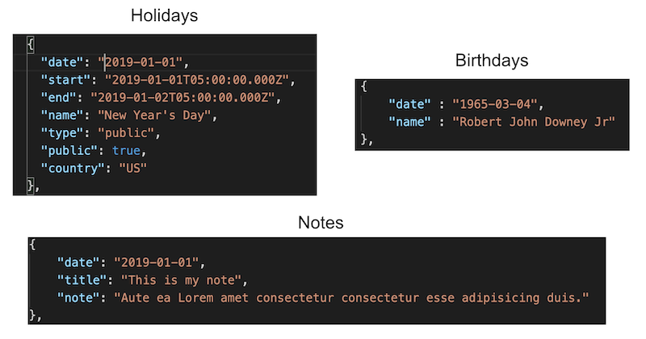

# Calendar-API

Calendar-API

This is a RESTful API for an interactive calendar. There are three models: Holidays, Birthdays, and Notes and all three have CRUD functionality. 

## Requirements

- [Node JS](https://nodejs.org/en/)
- [Mongo DB](https://www.mongodb.com/download-center)

## Installation

First install the requirements. Then download this repo to your hard drive. You'll then need to use `npm install` in the root of the amiibo_api folder to install dependencies. It should install cors, body-parse, express, mongoose, and node-fetch. 

There currently is a small set of data in three json files to use as seed data. You can run `node seed.js` from the `/db` folder to send the data into a mongo database. There will be a collection for all three models.

## Usage

The following routes are currently set to be used. You can test GET by running `nodemon` in the root folder and go to `localhost:3000` in your browser. You can also use [Postman](https://www.getpostman.com/) to test everything out. Replace DOMAIN with either localhost:3000 or whatever domain you have the API installed on.

## Routes

### Holidays

| Route                                                | URL                                                             | Method | Description                                                                    |
| ---------------------------------------------------- | :-------------------------------------------------------------- | :----- | :----------------------------------------------------------------------------- |
| "/holiday"                                | http://DOMAIN/holiday                                | GET    | Shows all holidays in the database                                  |
| "/holiday/id/:id"                         | http://DOMAIN/id/<"id">                              | GET    | Searching holiday by ID.                                            |
| "/holiday/date/:date"                     | http://DOMAIN/date/<"date">                          | GET    | Search holiday by date. The date format is YYYY-MM-DD.              |
| "/holiday/date/:dateStart/:dateEnd"       | http://DOMAIN/date/<"Start Date">/<"End Date">       | GET    | Search holidays by a range of dates. The date format is YYYY-MM-DD. |
| "/holiday/date-short/:dateStart/:dateEnd" | http://DOMAIN/date-short/<"Start Date">/<"End Date"> | GET    | Search holidays by a range of dates. The date format is MM-DD.      |
| "/holiday/name/:name"                     | http://DOMAIN/name/<"name">                          | GET    | Search by holiday name.                                             |
| "/holiday/country/:country"               | http://DOMAIN/country/<"country">                    | GET    | Search by country (US/CA/MX).                                       |
| "/holiday"                                | http://DOMAIN/holiday                                | POST   | Creates holiday listing.                                            |
| "/holiday/id/:id"                         | http://DOMAIN/id/<"id">                              | PUT    | Edits an holiday listing                                            |
| "/holiday/id/:id"                         | http://DOMAIN/id/<"id">                              | DELETE | Deletes an holiday listing                                          |

### Birthdays

| Route                                                 | URL                                                             | Method | Description                                                                |
| ----------------------------------------------------- | :-------------------------------------------------------------- | :----- | :------------------------------------------------------------------------- |
| "/birthday"                                | http://DOMAIN/birthday                               | GET    | Shows all birthdays in the database                             |
| "/birthday/id/:id"                         | http://DOMAIN/id/<"id">                              | GET    | Searching birthday by ID.                                       |
| "/birthday/date/:date"                     | http://DOMAIN/date/<"date">                          | GET    | Search birthday by date. The date format is YYYY-MM-DD.         |
| "/birthday/date-short/:dateStart/:dateEnd" | http://DOMAIN/date-short/<"Start Date">/<"End Date"> | GET    | Search birthdays by a range of dates. The date format is MM-DD. |
| "/birthday/name/:name"                     | http://DOMAIN/name/<"name">                          | GET    | Search by birthday name.                                        |
| "/birthday"                                | http://DOMAIN/birthday                               | POST   | Creates birthday listing.                                       |
| "/birthday/id/:id"                         | http://DOMAIN/id/<"id">                              | PUT    | Edits an birthday listing                                       |
| "/birthday/id/:id"                         | http://DOMAIN/id/<"id">                              | DELETE | Deletes an birthday listing                                     |

### Notes

| Route                                       | URL                                                       | Method | Description                                                                 |
| ------------------------------------------- | :-------------------------------------------------------- | :----- | :-------------------------------------------------------------------------- |
| "/note"                          | http://DOMAIN/note                             | GET    | Shows all notes in the database                                  |
| "/note/id/:id"                   | http://DOMAIN/id/<"id">                        | GET    | Searching note by ID.                                            |
| "/note/date/:date"               | http://DOMAIN/date/<"date">                    | GET    | Search note by date. The date format is YYYY-MM-DD.              |
| "/note/date/:dateStart/:dateEnd" | http://DOMAIN/date/<"Start Date">/<"End Date"> | GET    | Search notes by a range of dates. The date format is YYYY-MM-DD. |
| "/note/title/:title"             | http://DOMAIN/title/<"title">                  | GET    | Search by note title.                                            |
| "/note"                          | http://DOMAIN/note                             | POST   | Creates note listing.                                            |
| "/note/id/:id"                   | http://DOMAIN/id/<"id">                        | PUT    | Edits an note listing                                            |
| "/note/id/:id"                   | http://DOMAIN/id/<"id">                        | DELETE | Deletes an note listing                                          |

## Author

William Chrapcynski: all code